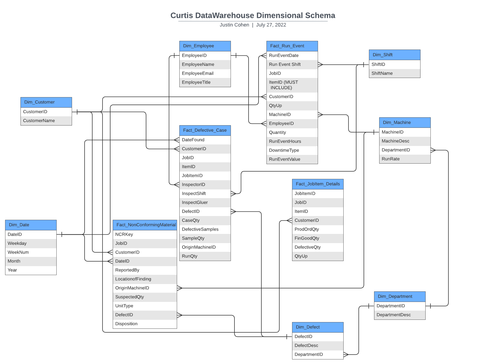

# CompanyDW
This repository will hold all SQL, test data files, python scripts, and more for creating and populating the CurtisDW and its supporting ELT pipelines.

 
## Problem Statement
The medium-sized custom manufacturing company I work for was started in 1775. Obviously, creating a full stack data engineering infrastructural solution was not the number one thing on the founders minds. Upon arriving at the company, it struck me that even since then, a focused effort on developing a data management workflow was never really been made. Every single row of data outside of our production database is being stored and managed with Excel, along with some weakly managed manual data extractions and migration carried out weekly to feed a collection of excel charts in master documents for reporting. 

## The Solution
My objective felt clear: to architect and implement a new front to back, best practice, and scalable data management and analytics solution for the company, or die trying! Jokes... but I would give it my all! This way it wouldn't be held back by poor data management practices, but instead be empowered to take advantage of new insights with the potential to drive improvement through making important decisions based upon the wealth of currently under-utilized data within the organization.

## Project Timeline

### Design Phase
*May 2022 - August 2022*

The design phase of this project started in while I was living in Italy during May and June this summer. With the time away from the office, I started to hash out the details of the project: the different data sources at play, the specific technologies I would want to bring into the mix, and ultimately the analytical framework I envisioned for the company. This work included drafting a dimensional schema design for the data warehouse, and working out a rough concept for the types of ETL activities that would be required.

### Construction Phase
*August 2022 - October 2022*

This phase of the project is integral to it's success, hence the large time period alotted. Soft deadline for sometime in october to have completed construction of all componentes, source connections, pipelines, warehouse, and dashboard connections. 

### Implementation Phase
*October 2022 - December 2022*

This phase will involve connecting all the dots. Pipelines will be initiated to run at scheduled intervals, query performance will be monitored and optimized if necessary, and errors will be debugged as they come. The bulk of this phase will be fine tuning all of the players within the workflow to be as efficient as possible.

---
## Resources
I'm not just doing this stuff with a pen and paper!

### Platforms
* Microsoft Azure
* Docker

### Tools
* Airflow
* PostgreSQL
* Power BI
* LucidChart
* Jira
* Github (duh)
* Visual Studio Code

### Languages
* Python
* SQL/T-SQL
* Microsoft DAX
* Microsoft M
* Javascript (maybe for building data capture apps)

---

## Data Warehouse Dimensional Schema

I opted for a galaxy schema for this project. Present are several fact tables representing various production events, surrounded by a constellation of dimensions, many of which supporting more than one fact table. 

A few of the fact tables shown in the final dimensional structure are the product of complex transformations and joins imposed  upon staging tables which have been kept in their raw form from their source tables, so as to reduce query complexity and therefore strain on the operational DB. These transformations will either take place within a staging area of the warehouse itself, or in an external staging area, prior to load.

*This schema design is dynamic; new versions will be uploaded when revisions occur.*

